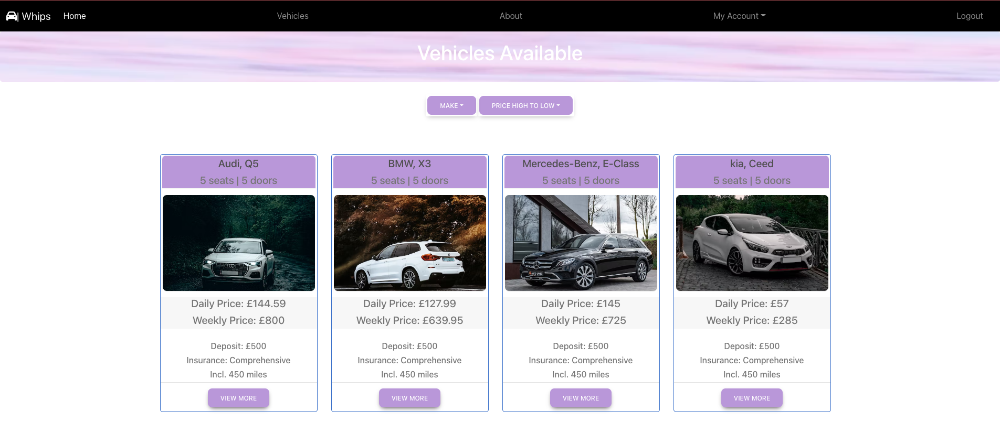

# whips-car-rental

## Whips Car Rental Summary

Whips Car Rental - Your Quick and easy rental service that creates a nice and easy experience for our customers. We want to make renting a car as simple and personal as driving your own.
Renting a car brings you freedom, and we’ll help you find the right car for you at a great price. But there’s much more to us than that. We're here to make renting a car a lot less hassle.

A user will ne able to sign up and login, from there you will have access to our catalogue of cars, where you will be able to book and delete. A user will also have the ability to
update their personal details on their account.

## Getting Started

To run our application you would have to firslty git clone the repository.

GitHub repository: [https://github.com/awarsame1996/whips-car-rental.git](https://github.com/awarsame1996/whips-car-rental.git)

cd whips-car-rental
cd server nmp i && cd client npm i

## About The Project

Whips Car Rental is a React.js application, using Graphql queries and mutations to connect with our Apollo server and mongoDB database.

## Future Potential Additions

- Update website with a blogs page where we can update the users regarding any changes or additions to our services, users can also leave feedback on the blogs via comments section of the specific blog.
- Add a option where users can add a profile picture to further personalise their account.
- Add a booking cancellation feature.
- add a review section after they complete their booking which we can use as customer feedback to continue and improve our services.

## Screenshots

## contributors

[Abdilatif Warsame](https://github.com/awarsame1996)
[Abdinasir Warsame](https://github.com/abdinasir1993)
